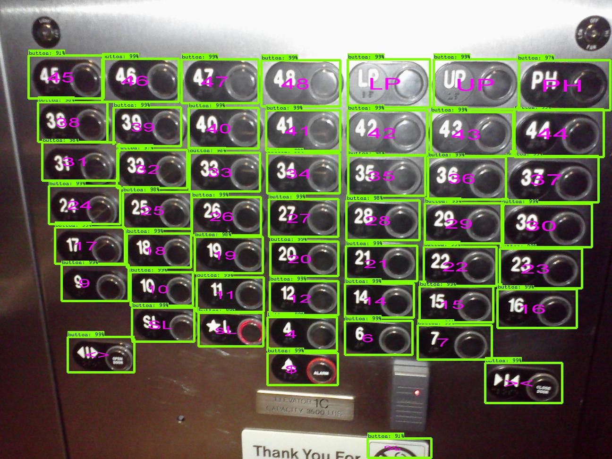
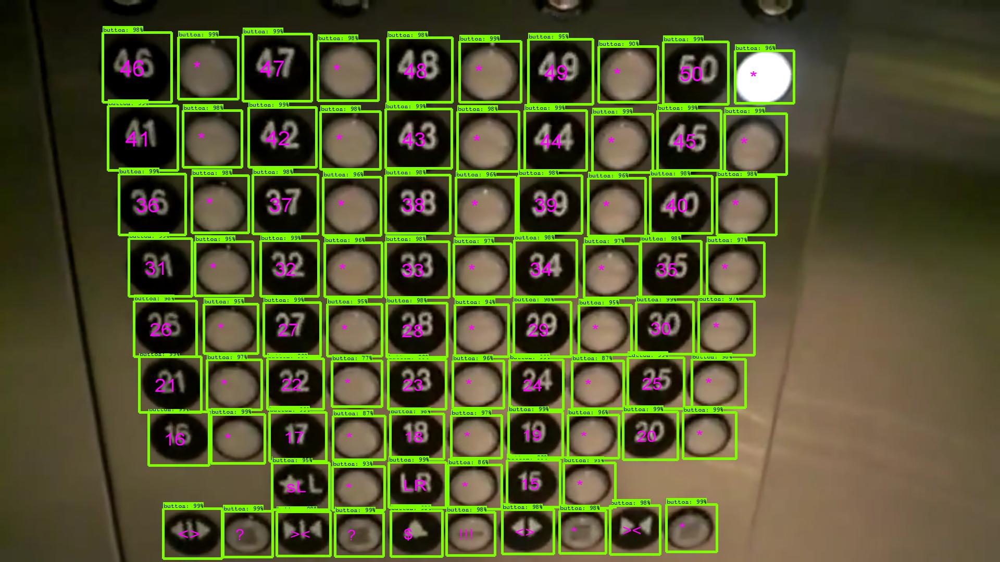

# Accurate and Efficient Elevator Button Localization

OCR-RCNN-v2 is designed for autonomous elevator manipulation, the goal of which is to enable the robot to autonomously operate elevators that are previously unvisited. This repository contains the perception part of this project.  We published the initial version in paper  [A Novel OCR-RCNN for Elevator Button Recognition](https://ieeexplore.ieee.org/abstract/document/8594071) and this version improves the accuracy by 20% and achieves a real-time running speed ~10FPS (640*480)  on a graphical card (>=GTX950).  We have also tested on a laptop installed with a GTX950M (2G memory). It can achieves a running speed of ~6FPS. We are working on updating the TX2 compatible versions to make it work with JetPack 4.2,  which will be soon released with the dataset, as well as the post-processing code. 

### Requirements

1.  Ubuntu == 16.04
2.  TensorFlow == 1.12.0
3.  Python == 2.7
4.  Tensorrt == 4.0 (optional)
5.  2GB GPU (or shared) memory 

### Inference

Before running the code, please first download the [models](https://drive.google.com/file/d/1FVXI-G-EsCrkKbknhHL-9Y1pBshY7JCv/view?usp=sharing) into the code folder. There are five frozen tensorflow models:

1. *detection_graph.pb*: a general detection model that can handle panel images with arbitrary size.
2.  *ocr_graph.pb*: a character recognition model that can handle button images with a size of 180x180.
3. *detection_graph_640x480.pb*: a detection model  fixed-size image as input.
4. *detection_graph_640x480_optimized.pb*: an optimized version of the detection model.
5. *ocr_graph_optimized.pb*:  an optimized version of the recognition model.

For running in laptops and desktops, you may need to install some packages :

1. `sudo apt install libjpeg-dev libpng12-dev libfreetype6-dev libxml2-dev libxslt1-dev`
2. `pip install pillow, matplotlib, lxml` 
3. `git clone https://github.com/zhudelong/ocr-rcnn-v2.git`
4. `cd ocr-rcnn-v2`
5. ``mv frozen/ ocr-rcnn-v2/``
6. `python inference.py`  (slow version with two models loaded separately) 
7. ``python inference_640x480.py`` (fast version with two models merged)
8. `python ocr-rcnn-v2-visual.py` (for visualization)

For Nvidia TX-2 platform:

1. flash your system with [JetPack 4.2](<https://developer.nvidia.com/embedded/jetpack>)
2. we have to install tensorflow-1.12.0 by compiling by ourselves for now.
3. if you are interested in converting the model by yourself, please check [here](https://jkjung-avt.github.io/tf-trt-models/)

### Demonstrations

Two demo-images are listed as follows. They are screenshots from two Youtube videos. The character recognition results are visualized at the center of each bounding box. 

  

    
    Image Source: [https://www.youtube.com/watch?v=bQpEYpg1kLg&t=8s]
  

  

    
    Image Source: [https://www.youtube.com/watch?v=k1bTibYQjTo&t=9s]
  
